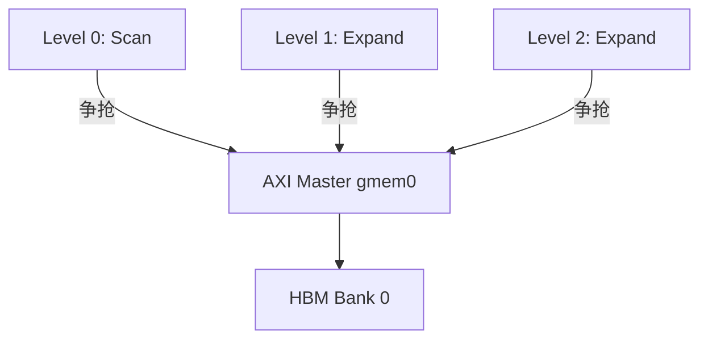
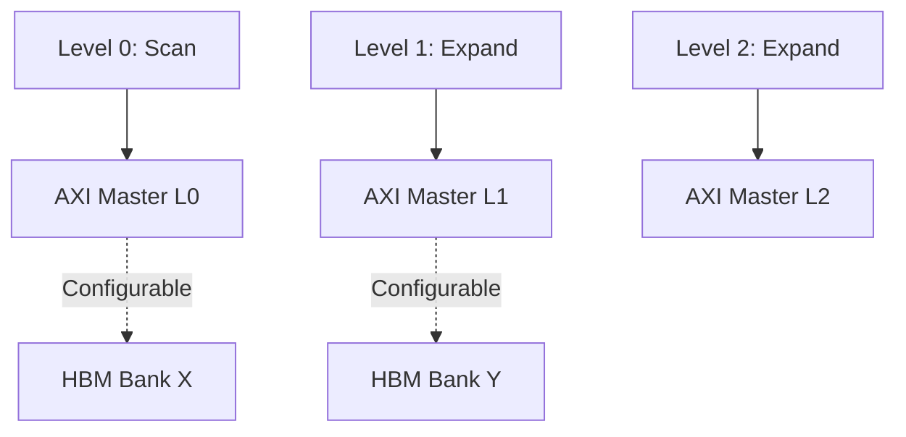

---

# 架构重构方案：Plan-5 流水线多端口内存访问 (Multi-Port Memory Access)

## 1. 背景与问题描述

在当前的 `subgraph_kernel_plan5_v1` 设计中，我们使用了 HLS `DATAFLOW` 指令来实现 5 级图匹配流水线 (`plan5_pipeline_pe`)。然而，在综合阶段遇到了 **Global Memory Port Conflict (结构性冲突)** 报错。

### 问题根因

* **现状**：所有流水线阶段（Level 0 到 Level 4）共享同一个 C++ 指针接口（即同一个 AXI Master 端口）来读取图数据 (`gmem_bcsr_data`)。
* **冲突**：在 `DATAFLOW` 模式下，Level 0（扫描）、Level 1（扩展）、Level 2（扩展）等是并行运行的。当多个 Stage 在同一时刻尝试从同一个 AXI Master 端口发起读请求时，HLS 无法仲裁，因为物理端口在同一时钟周期只能处理一个请求。

## 2. 解决方案概览

为了解决编译报错并释放流水线的并行性能，我们需要实施 **“接口解耦 (Interface Decoupling)”** 策略。

### 核心变更

1. **接口拆分**：将原本共享的一个 AXI 接口，拆分为 5 个独立的 AXI 接口（L0 ~ L4）。每个流水线阶段拥有自己专属的内存通道。
2. **Top 层透传**：在 Kernel 顶层为每个 PE 暴露出独立的 5个 Bundle，确保 HLS 为每个阶段生成独立的 AXI Master 适配器。
3. **链接配置**：通过 Vitis Linker (`.cfg`) 将这些接口灵活映射到 HBM Banks。

### 架构图示

**Before (冲突):**



**After (解耦):**



---

## 3. 实施步骤 (Implementation Steps)

### 步骤 1: 修改 PE 执行逻辑 (`task_executor_v16_origin8.hpp`)

修改 `plan5_pipeline_pe` 函数签名，不再接收单一的数据指针，而是接收 5 组独立的指针。

```cpp
// 修改 plan5_pipeline_pe 增加参数
inline void plan5_pipeline_pe(
    const QueryPlan5& plan,
    // --- 拆分开始 ---
    const data_t* gmem_v1_L0, const data_t* gmem_v2_L0, // Level 0 专用
    const data_t* gmem_v1_L1, const data_t* gmem_v2_L1, // Level 1 专用
    const data_t* gmem_v1_L2, const data_t* gmem_v2_L2, // ...
    const data_t* gmem_v1_L3, const data_t* gmem_v2_L3,
    const data_t* gmem_v1_L4, const data_t* gmem_v2_L4, // Level 4 专用
    // --- 拆分结束 ---
    const int* gmem_row_ptr,
    int num_vertices,
    hls::stream<Embedding5>& in0,
    hls::stream<long long>& out_count
) {
    // ... 配置初始化 ...

#pragma HLS DATAFLOW
    // 将独立指针传给对应的 Level Unit
    plan5_level_unit(cfgs[0], gmem_v1_L0, gmem_v2_L0, ...);
    plan5_level_unit(cfgs[1], gmem_v1_L1, gmem_v2_L1, ...);
    plan5_level_unit(cfgs[2], gmem_v1_L2, gmem_v2_L2, ...);
    plan5_level_unit(cfgs[3], gmem_v1_L3, gmem_v2_L3, ...);
    plan5_level_unit(cfgs[4], gmem_v1_L4, gmem_v2_L4, ...);
    
    plan5_count_embeddings(s5, out_count);
}

```

### 步骤 2: 修改 Top Kernel (`testSIU_v7_gemini_1.cpp`)

在顶层函数中，必须显式定义所有端口，并使用 `#pragma HLS INTERFACE` 指定不同的 `bundle` 名称。这是 HLS 生成独立适配器的关键。

> **注意**：为了避免接口数量爆炸，我们假设每个 PE 独占一组接口。如果有 4 个 PE，参数列表会很长，但这是必要的。

```cpp
void subgraph_kernel_plan5_v1(
    // === PE 0 接口 (Bundle: gmem_pe0_L0 ~ L4) ===
    const data_t* gmem_pe0_v1_L0, const data_t* gmem_pe0_v2_L0,
    const data_t* gmem_pe0_v1_L1, const data_t* gmem_pe0_v2_L1,
    // ... (补全 L2, L3)
    const data_t* gmem_pe0_v1_L4, const data_t* gmem_pe0_v2_L4,

    // === PE 1 接口 (Bundle: gmem_pe1_L0 ~ L4) ===
    const data_t* gmem_pe1_v1_L0, const data_t* gmem_pe1_v2_L0,
    // ... 以此类推，为每个 PE 定义
    
    // 公共参数
    const int* gmem_row_ptr,
    // ...
) {
    // === Pragma 定义 ===
    // 关键：Bundle 名字必须不同，这样 HLS 才会生成独立的 AXI Master
    #pragma HLS INTERFACE m_axi port=gmem_pe0_v1_L0 bundle=gmem0 offset=slave ...
    #pragma HLS INTERFACE m_axi port=gmem_pe0_v2_L0 bundle=gmem0 offset=slave ...
    #pragma HLS INTERFACE m_axi port=gmem_pe0_v1_L1 bundle=gmem1 offset=slave ...
    #pragma HLS INTERFACE m_axi port=gmem_pe0_v2_L1 bundle=gmem1 offset=slave ...
    // ...

    // === 调用 PE ===
    plan5_pipeline_pe(plan, 
        gmem_pe0_v1_L0, gmem_pe0_v2_L0, // L0
        gmem_pe0_v1_L1, gmem_pe0_v2_L1, // L1
        // ...
        level0_streams[0], result_streams[0]
    );
}

```

---

## 4. 链接配置与性能优化 (Configuration & Optimization)

代码修改完成后，我们通过 Vitis Linker (`v++ --link`) 的 `.cfg` 文件来控制内存映射。

### : 重新优化与验证


**目标**：消除流水线中的内存争用，实现 5 倍带宽。
**策略**：利用 **数据复制**。在 Host 端将图数据复制 5 份，分别存入 HBM Bank 0, 1, 2, 3, 4。
**Host 端修改**：需分配 5 个 Buffer，内容完全相同。
**配置写法**：

```ini
[connectivity]
# 每个 Level 独占一个 Bank，真正的并行读取
sp=subgraph_kernel_plan5_v1_1.gmem_pe0_v1_L0:HBM[0]
sp=subgraph_kernel_plan5_v1_1.gmem_pe0_v2_L0:HBM[0]
sp=subgraph_kernel_plan5_v1_1.gmem_pe0_v1_L1:HBM[1]
sp=subgraph_kernel_plan5_v1_1.gmem_pe0_v2_L1:HBM[1]
sp=subgraph_kernel_plan5_v1_1.gmem_pe0_v1_L2:HBM[2]
sp=subgraph_kernel_plan5_v1_1.gmem_pe0_v2_L2:HBM[2]
sp=subgraph_kernel_plan5_v1_1.gmem_pe0_v1_L3:HBM[3]
sp=subgraph_kernel_plan5_v1_1.gmem_pe0_v2_L3:HBM[3]
sp=subgraph_kernel_plan5_v1_1.gmem_pe0_v1_L4:HBM[4]
sp=subgraph_kernel_plan5_v1_1.gmem_pe0_v2_L4:HBM[4]
...............
```

## 5. 下一步工作 (Action Items)

1. **代码重构**：按照 **步骤 1** 和 **步骤 2** 更新 HLS C++ 代码。
2. **综合检查**：运行 `vitis_hls` C Synthesis，确保没有 Port Conflict 报错，且生成了预期的 Adapter 数量。
3. **连接配置**：编写 `.cfg` 文件，首先采用 Phase 1 配置进行上板测试。
4. **性能迭代**：如果带宽成为瓶颈，修改 Host 代码实施 Phase 2 的数据复制策略。